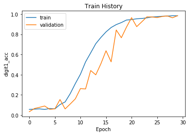

# HTSRC 高鐵訂票驗證碼

### 免責條款

此專案是個人學習如何使用 Deep Learning 中的 CNN，使用 Python 的 Keras、Tensorflow 進行實作，請勿使用於不法用途。若因使用該專案而大量訂票，相關的刑事、民事相關責任，請自行負責。

### 參考資料

其實基本上都是依照下面三個參考資料在實作，所以有疑問請在參考一下這些資料。

[gary9987/-Keras-Python3.6-captcha](https://github.com/gary9987/-Keras-TensorFlow-Python3.6-)

[[爬蟲實戰] 如何破解高鐵驗證碼 (1) - 去除圖片噪音點?](https://www.youtube.com/watch?v=6HGbKdB4kVY)

[[爬蟲實戰] 如何破解高鐵驗證碼 (2) - 使用迴歸方法去除多餘弧線?](https://www.youtube.com/watch?v=4DHcOPSfC4c)

### Dependencies

請先安裝相關的 python 套件

```sh
pip3 install -r requirements.txt
```

### 步驟

大致上分為四個步驟，以下會分步驟說明
- 爬蟲
- 預處理
- 標記圖片
- CNN深度學習

### 爬蟲

爬蟲請參考 `crawler.ipynb` 和編譯出來的 `crawler.py`。此程式使用 Selenium Chrome driver 去抓取高鐵螢幕截圖，再切割出驗證碼圖片存入至 captcha 目錄下。

需要注意的是，因為我使用 Macbook Pro 的 Retina 螢幕，使用螢幕截圖時，解析度會自動變為2倍，所以中間有一段程式在處理這個 ratio，不過最後都存成 140 x 48 的圖片。

檔案列表：

| # | ipython notebook 檔 | python檔 |
|---|---|---|
| 1 | crawler.ipynb | crawler.py |

### 預處理

圖片預處理就參考[參考資料](#參考資料)的 youtube 教學影片，比較麻煩的是處理上方一條線。這部分我認為預處理沒有作的比參考資料1弄的漂亮，主要是因為其實高鐵的驗證碼圖片大小不是固定的，若是刪除此弧線若是可以根據圖片的高度，這樣效果會更好，但是我基本上分為三個步驟處理圖片，沒有把步驟1和步驟2合起來處理。

檔案列表：

| # | ipython notebook 檔 | python檔 |
|---|---|---|
| 1 | preprocess.ipynb |  |
| 2 | preprocess-batch.ipynb | preprocess-batch.py |

### 標記圖片

標記圖片花了很多時間，所以中間衍生我弄了另外一個專案 [label_captcha_tool](https://github.com/maxmilian/label_captcha_tool)。主要是因為找了一些標記工具，發現有些是 windows 的，而或者是安裝有點麻煩，不如我就自己寫了一套網頁的版本，當然好處就是可以跨平台，也就是一個 html 而已，也不用安裝，算是大大節省我的時間。

這邊就標記檔，存成為 csv (`label.csv`)，每一個圖片一行，之後要丟入 CNN 當作 label 的訓練資料。

### CNN深度學習

CNN部分就直接使用參考資料1，這部分優化比較少

| # | ipython notebook 檔 | python檔 |
|---|---|---|
| 1 | cnn.ipynb | |

這邊就標記檔，存成為 csv，每一個圖片一行，之後要丟入 CNN 當作 label 的訓練資料。

```sh
Epoch 1/25
2800/2800 [==============================] - 107s 38ms/step - loss: 16.7109 - digit1_loss: 4.1092 - digit2_loss: 4.2088 - digit3_loss: 4.2350 - digit4_loss: 4.1579 - digit1_acc: 0.0607 - digit2_acc: 0.0475 - digit3_acc: 0.0486 - digit4_acc: 0.0521 - val_loss: 12.4275 - val_digit1_loss: 3.0967 - val_digit2_loss: 3.1404 - val_digit3_loss: 3.1458 - val_digit4_loss: 3.0446 - val_digit1_acc: 0.0557 - val_digit2_acc: 0.0571 - val_digit3_acc: 0.0514 - val_digit4_acc: 0.0486

Epoch 00001: saving model to model/01-16.71-12.43.hdf5
Epoch 2/25
2800/2800 [==============================] - 113s 41ms/step - loss: 14.5190 - digit1_loss: 3.6065 - digit2_loss: 3.6516 - digit3_loss: 3.6368 - digit4_loss: 3.6241 - digit1_acc: 0.0507 - digit2_acc: 0.0486 - digit3_acc: 0.0532 - digit4_acc: 0.0604 - val_loss: 12.3756 - val_digit1_loss: 3.0903 - val_digit2_loss: 3.2185 - val_digit3_loss: 3.0509 - val_digit4_loss: 3.0159 - val_digit1_acc: 0.0786 - val_digit2_acc: 0.0486 - val_digit3_acc: 0.0786 - val_digit4_acc: 0.0700

Epoch 00002: saving model to model/02-14.52-12.38.hdf5
Epoch 3/25
2800/2800 [==============================] - 117s 42ms/step - loss: 13.6138 - digit1_loss: 3.3852 - digit2_loss: 3.4383 - digit3_loss: 3.3928 - digit4_loss: 3.3976 - digit1_acc: 0.0550 - digit2_acc: 0.0621 - digit3_acc: 0.0525 - digit4_acc: 0.0529 - val_loss: 11.9425 - val_digit1_loss: 2.9975 - val_digit2_loss: 2.9526 - val_digit3_loss: 2.9945 - val_digit4_loss: 2.9979 - val_digit1_acc: 0.0357 - val_digit2_acc: 0.0557 - val_digit3_acc: 0.0600 - val_digit4_acc: 0.0643

Epoch 00003: saving model to model/03-13.61-11.94.hdf5
Epoch 4/25
2800/2800 [==============================] - 126s 45ms/step - loss: 12.6738 - digit1_loss: 3.1548 - digit2_loss: 3.1757 - digit3_loss: 3.1629 - digit4_loss: 3.1804 - digit1_acc: 0.0564 - digit2_acc: 0.0564 - digit3_acc: 0.0575 - digit4_acc: 0.0596 - val_loss: 11.8259 - val_digit1_loss: 2.9244 - val_digit2_loss: 2.9488 - val_digit3_loss: 2.9663 - val_digit4_loss: 2.9864 - val_digit1_acc: 0.0714 - val_digit2_acc: 0.0600 - val_digit3_acc: 0.0557 - val_digit4_acc: 0.0471

Epoch 00004: saving model to model/04-12.67-11.83.hdf5
Epoch 5/25
2800/2800 [==============================] - 114s 41ms/step - loss: 12.0446 - digit1_loss: 2.9947 - digit2_loss: 3.0180 - digit3_loss: 3.0090 - digit4_loss: 3.0229 - digit1_acc: 0.0700 - digit2_acc: 0.0654 - digit3_acc: 0.0636 - digit4_acc: 0.0550 - val_loss: 11.7630 - val_digit1_loss: 2.9258 - val_digit2_loss: 2.9331 - val_digit3_loss: 2.9353 - val_digit4_loss: 2.9688 - val_digit1_acc: 0.0771 - val_digit2_acc: 0.0500 - val_digit3_acc: 0.0886 - val_digit4_acc: 0.0471

Epoch 00005: saving model to model/05-12.04-11.76.hdf5
Epoch 6/25
2800/2800 [==============================] - 114s 41ms/step - loss: 11.8001 - digit1_loss: 2.9342 - digit2_loss: 2.9435 - digit3_loss: 2.9479 - digit4_loss: 2.9745 - digit1_acc: 0.0696 - digit2_acc: 0.0711 - digit3_acc: 0.0661 - digit4_acc: 0.0564 - val_loss: 11.7209 - val_digit1_loss: 2.9485 - val_digit2_loss: 2.9142 - val_digit3_loss: 2.9089 - val_digit4_loss: 2.9493 - val_digit1_acc: 0.0571 - val_digit2_acc: 0.0657 - val_digit3_acc: 0.0714 - val_digit4_acc: 0.0400

Epoch 00006: saving model to model/06-11.80-11.72.hdf5
Epoch 7/25
2800/2800 [==============================] - 122s 44ms/step - loss: 11.5313 - digit1_loss: 2.8680 - digit2_loss: 2.8566 - digit3_loss: 2.8635 - digit4_loss: 2.9431 - digit1_acc: 0.0889 - digit2_acc: 0.1121 - digit3_acc: 0.0950 - digit4_acc: 0.0675 - val_loss: 11.9389 - val_digit1_loss: 3.0044 - val_digit2_loss: 3.0128 - val_digit3_loss: 2.9520 - val_digit4_loss: 2.9698 - val_digit1_acc: 0.0543 - val_digit2_acc: 0.0600 - val_digit3_acc: 0.0643 - val_digit4_acc: 0.0586

Epoch 00007: saving model to model/07-11.53-11.94.hdf5
Epoch 8/25
2800/2800 [==============================] - 114s 41ms/step - loss: 11.2049 - digit1_loss: 2.7748 - digit2_loss: 2.7416 - digit3_loss: 2.7609 - digit4_loss: 2.9276 - digit1_acc: 0.1093 - digit2_acc: 0.1289 - digit3_acc: 0.1164 - digit4_acc: 0.0775 - val_loss: 11.6754 - val_digit1_loss: 2.9225 - val_digit2_loss: 2.9469 - val_digit3_loss: 2.8627 - val_digit4_loss: 2.9433 - val_digit1_acc: 0.0643 - val_digit2_acc: 0.0557 - val_digit3_acc: 0.0843 - val_digit4_acc: 0.0543

Epoch 00008: saving model to model/08-11.20-11.68.hdf5
Epoch 9/25
2800/2800 [==============================] - 116s 41ms/step - loss: 10.9384 - digit1_loss: 2.6893 - digit2_loss: 2.6692 - digit3_loss: 2.6887 - digit4_loss: 2.8913 - digit1_acc: 0.1389 - digit2_acc: 0.1343 - digit3_acc: 0.1196 - digit4_acc: 0.0904 - val_loss: 12.1687 - val_digit1_loss: 3.0687 - val_digit2_loss: 3.1123 - val_digit3_loss: 3.0031 - val_digit4_loss: 2.9846 - val_digit1_acc: 0.0486 - val_digit2_acc: 0.0500 - val_digit3_acc: 0.0657 - val_digit4_acc: 0.0443

Epoch 00009: saving model to model/09-10.94-12.17.hdf5
Epoch 10/25
2800/2800 [==============================] - 118s 42ms/step - loss: 10.6856 - digit1_loss: 2.6041 - digit2_loss: 2.6047 - digit3_loss: 2.6309 - digit4_loss: 2.8460 - digit1_acc: 0.1521 - digit2_acc: 0.1571 - digit3_acc: 0.1479 - digit4_acc: 0.1054 - val_loss: 10.7800 - val_digit1_loss: 2.6362 - val_digit2_loss: 2.6428 - val_digit3_loss: 2.6621 - val_digit4_loss: 2.8390 - val_digit1_acc: 0.1586 - val_digit2_acc: 0.1600 - val_digit3_acc: 0.1529 - val_digit4_acc: 0.0943

Epoch 00010: saving model to model/10-10.69-10.78.hdf5
Epoch 11/25
2800/2800 [==============================] - 113s 40ms/step - loss: 10.3469 - digit1_loss: 2.4689 - digit2_loss: 2.5265 - digit3_loss: 2.5468 - digit4_loss: 2.8048 - digit1_acc: 0.1786 - digit2_acc: 0.1771 - digit3_acc: 0.1639 - digit4_acc: 0.1193 - val_loss: 11.4256 - val_digit1_loss: 2.8287 - val_digit2_loss: 2.8618 - val_digit3_loss: 2.8268 - val_digit4_loss: 2.9083 - val_digit1_acc: 0.0900 - val_digit2_acc: 0.0829 - val_digit3_acc: 0.1014 - val_digit4_acc: 0.0671

Epoch 00011: saving model to model/11-10.35-11.43.hdf5
Epoch 12/25
2800/2800 [==============================] - 112s 40ms/step - loss: 9.9863 - digit1_loss: 2.3238 - digit2_loss: 2.4155 - digit3_loss: 2.4884 - digit4_loss: 2.7586 - digit1_acc: 0.2300 - digit2_acc: 0.2171 - digit3_acc: 0.1832 - digit4_acc: 0.1311 - val_loss: 11.7676 - val_digit1_loss: 3.0018 - val_digit2_loss: 2.9324 - val_digit3_loss: 2.9067 - val_digit4_loss: 2.9267 - val_digit1_acc: 0.0700 - val_digit2_acc: 0.0957 - val_digit3_acc: 0.0786 - val_digit4_acc: 0.0514

Epoch 00012: saving model to model/12-9.99-11.77.hdf5
Epoch 13/25
2800/2800 [==============================] - 115s 41ms/step - loss: 9.4391 - digit1_loss: 2.1069 - digit2_loss: 2.2806 - digit3_loss: 2.3539 - digit4_loss: 2.6976 - digit1_acc: 0.2946 - digit2_acc: 0.2518 - digit3_acc: 0.2279 - digit4_acc: 0.1379 - val_loss: 11.6869 - val_digit1_loss: 3.0191 - val_digit2_loss: 2.8962 - val_digit3_loss: 2.8858 - val_digit4_loss: 2.8859 - val_digit1_acc: 0.1143 - val_digit2_acc: 0.1000 - val_digit3_acc: 0.0943 - val_digit4_acc: 0.0571

Epoch 00013: saving model to model/13-9.44-11.69.hdf5
Epoch 14/25
2800/2800 [==============================] - 115s 41ms/step - loss: 8.5993 - digit1_loss: 1.7538 - digit2_loss: 2.1041 - digit3_loss: 2.1820 - digit4_loss: 2.5594 - digit1_acc: 0.4204 - digit2_acc: 0.3036 - digit3_acc: 0.2729 - digit4_acc: 0.1875 - val_loss: 12.5353 - val_digit1_loss: 3.2598 - val_digit2_loss: 3.1634 - val_digit3_loss: 3.0922 - val_digit4_loss: 3.0199 - val_digit1_acc: 0.1457 - val_digit2_acc: 0.0786 - val_digit3_acc: 0.0671 - val_digit4_acc: 0.0471

Epoch 00014: saving model to model/14-8.60-12.54.hdf5
Epoch 15/25
2800/2800 [==============================] - 118s 42ms/step - loss: 7.6108 - digit1_loss: 1.3987 - digit2_loss: 1.8638 - digit3_loss: 1.9497 - digit4_loss: 2.3986 - digit1_acc: 0.5389 - digit2_acc: 0.3832 - digit3_acc: 0.3379 - digit4_acc: 0.2282 - val_loss: 12.9372 - val_digit1_loss: 3.4778 - val_digit2_loss: 3.2452 - val_digit3_loss: 3.1268 - val_digit4_loss: 3.0873 - val_digit1_acc: 0.0986 - val_digit2_acc: 0.0714 - val_digit3_acc: 0.1029 - val_digit4_acc: 0.0414

Epoch 00015: saving model to model/15-7.61-12.94.hdf5
Epoch 16/25
2800/2800 [==============================] - 117s 42ms/step - loss: 6.6703 - digit1_loss: 1.1078 - digit2_loss: 1.6401 - digit3_loss: 1.7238 - digit4_loss: 2.1987 - digit1_acc: 0.6271 - digit2_acc: 0.4439 - digit3_acc: 0.4207 - digit4_acc: 0.2736 - val_loss: 12.5268 - val_digit1_loss: 3.3439 - val_digit2_loss: 3.1551 - val_digit3_loss: 2.9895 - val_digit4_loss: 3.0383 - val_digit1_acc: 0.1086 - val_digit2_acc: 0.0686 - val_digit3_acc: 0.1357 - val_digit4_acc: 0.0486

Epoch 00016: saving model to model/16-6.67-12.53.hdf5
Epoch 17/25
2800/2800 [==============================] - 110s 39ms/step - loss: 5.6967 - digit1_loss: 0.8847 - digit2_loss: 1.4174 - digit3_loss: 1.4806 - digit4_loss: 1.9139 - digit1_acc: 0.7157 - digit2_acc: 0.5321 - digit3_acc: 0.5039 - digit4_acc: 0.3654 - val_loss: 10.5086 - val_digit1_loss: 2.5586 - val_digit2_loss: 2.6790 - val_digit3_loss: 2.5378 - val_digit4_loss: 2.7332 - val_digit1_acc: 0.2629 - val_digit2_acc: 0.1486 - val_digit3_acc: 0.2371 - val_digit4_acc: 0.0986

Epoch 00017: saving model to model/17-5.70-10.51.hdf5
Epoch 18/25
2800/2800 [==============================] - 111s 39ms/step - loss: 4.7040 - digit1_loss: 0.7355 - digit2_loss: 1.1316 - digit3_loss: 1.2210 - digit4_loss: 1.6158 - digit1_acc: 0.7575 - digit2_acc: 0.6243 - digit3_acc: 0.5871 - digit4_acc: 0.4607 - val_loss: 10.6911 - val_digit1_loss: 2.6859 - val_digit2_loss: 2.6922 - val_digit3_loss: 2.5996 - val_digit4_loss: 2.7133 - val_digit1_acc: 0.2843 - val_digit2_acc: 0.2000 - val_digit3_acc: 0.2071 - val_digit4_acc: 0.1071

Epoch 00018: saving model to model/18-4.70-10.69.hdf5
Epoch 19/25
2800/2800 [==============================] - 106s 38ms/step - loss: 3.7462 - digit1_loss: 0.5916 - digit2_loss: 0.9323 - digit3_loss: 0.9444 - digit4_loss: 1.2779 - digit1_acc: 0.8107 - digit2_acc: 0.6939 - digit3_acc: 0.6839 - digit4_acc: 0.5711 - val_loss: 8.9718 - val_digit1_loss: 2.2519 - val_digit2_loss: 2.2428 - val_digit3_loss: 2.1542 - val_digit4_loss: 2.3230 - val_digit1_acc: 0.3471 - val_digit2_acc: 0.3229 - val_digit3_acc: 0.3100 - val_digit4_acc: 0.2229

Epoch 00019: saving model to model/19-3.75-8.97.hdf5
Epoch 20/25
2800/2800 [==============================] - 125s 45ms/step - loss: 2.9778 - digit1_loss: 0.4743 - digit2_loss: 0.7441 - digit3_loss: 0.7569 - digit4_loss: 1.0025 - digit1_acc: 0.8489 - digit2_acc: 0.7607 - digit3_acc: 0.7493 - digit4_acc: 0.6721 - val_loss: 7.8944 - val_digit1_loss: 2.0506 - val_digit2_loss: 2.0107 - val_digit3_loss: 1.8425 - val_digit4_loss: 1.9905 - val_digit1_acc: 0.3871 - val_digit2_acc: 0.3614 - val_digit3_acc: 0.4257 - val_digit4_acc: 0.3843

Epoch 00020: saving model to model/20-2.98-7.89.hdf5
Epoch 21/25
2800/2800 [==============================] - 119s 43ms/step - loss: 2.3917 - digit1_loss: 0.4053 - digit2_loss: 0.6169 - digit3_loss: 0.5835 - digit4_loss: 0.7859 - digit1_acc: 0.8693 - digit2_acc: 0.7971 - digit3_acc: 0.8182 - digit4_acc: 0.7457 - val_loss: 5.1216 - val_digit1_loss: 1.1568 - val_digit2_loss: 1.2736 - val_digit3_loss: 1.2433 - val_digit4_loss: 1.4478 - val_digit1_acc: 0.6386 - val_digit2_acc: 0.6414 - val_digit3_acc: 0.6400 - val_digit4_acc: 0.5871

Epoch 00021: saving model to model/21-2.39-5.12.hdf5
Epoch 22/25
2800/2800 [==============================] - 131s 47ms/step - loss: 1.9086 - digit1_loss: 0.3457 - digit2_loss: 0.4933 - digit3_loss: 0.4754 - digit4_loss: 0.5942 - digit1_acc: 0.8896 - digit2_acc: 0.8446 - digit3_acc: 0.8471 - digit4_acc: 0.8057 - val_loss: 4.8950 - val_digit1_loss: 1.1882 - val_digit2_loss: 1.3113 - val_digit3_loss: 1.1736 - val_digit4_loss: 1.2219 - val_digit1_acc: 0.6129 - val_digit2_acc: 0.6086 - val_digit3_acc: 0.6171 - val_digit4_acc: 0.6471

Epoch 00022: saving model to model/22-1.91-4.90.hdf5
Epoch 23/25
2800/2800 [==============================] - 104s 37ms/step - loss: 1.5628 - digit1_loss: 0.2980 - digit2_loss: 0.4236 - digit3_loss: 0.3914 - digit4_loss: 0.4498 - digit1_acc: 0.9068 - digit2_acc: 0.8757 - digit3_acc: 0.8786 - digit4_acc: 0.8664 - val_loss: 4.1936 - val_digit1_loss: 0.8991 - val_digit2_loss: 1.1335 - val_digit3_loss: 1.0226 - val_digit4_loss: 1.1384 - val_digit1_acc: 0.7157 - val_digit2_acc: 0.6700 - val_digit3_acc: 0.6757 - val_digit4_acc: 0.6286

Epoch 00023: saving model to model/23-1.56-4.19.hdf5
Epoch 24/25
2800/2800 [==============================] - 132s 47ms/step - loss: 1.3073 - digit1_loss: 0.2558 - digit2_loss: 0.3592 - digit3_loss: 0.3036 - digit4_loss: 0.3887 - digit1_acc: 0.9246 - digit2_acc: 0.8961 - digit3_acc: 0.9086 - digit4_acc: 0.8818 - val_loss: 1.5201 - val_digit1_loss: 0.2781 - val_digit2_loss: 0.4222 - val_digit3_loss: 0.3905 - val_digit4_loss: 0.4294 - val_digit1_acc: 0.9271 - val_digit2_acc: 0.8886 - val_digit3_acc: 0.8871 - val_digit4_acc: 0.9000

Epoch 00024: saving model to model/24-1.31-1.52.hdf5
Epoch 25/25
2800/2800 [==============================] - 116s 41ms/step - loss: 1.1049 - digit1_loss: 0.2146 - digit2_loss: 0.3073 - digit3_loss: 0.2574 - digit4_loss: 0.3256 - digit1_acc: 0.9321 - digit2_acc: 0.9043 - digit3_acc: 0.9243 - digit4_acc: 0.9075 - val_loss: 3.0071 - val_digit1_loss: 0.7142 - val_digit2_loss: 0.8354 - val_digit3_loss: 0.7461 - val_digit4_loss: 0.7114 - val_digit1_acc: 0.7600 - val_digit2_acc: 0.7443 - val_digit3_acc: 0.7543 - val_digit4_acc: 0.7786

Epoch 00025: saving model to model/25-1.10-3.01.hdf5
```

#### 訓練 log


# 其他

把 Jupyter Notebook 轉為 python script

```
# 爬蟲
jupyter nbconvert --to script crawler.ipynb

# 影像預處理
jupyter nbconvert --to script preprocessBatch.ipynb
```
